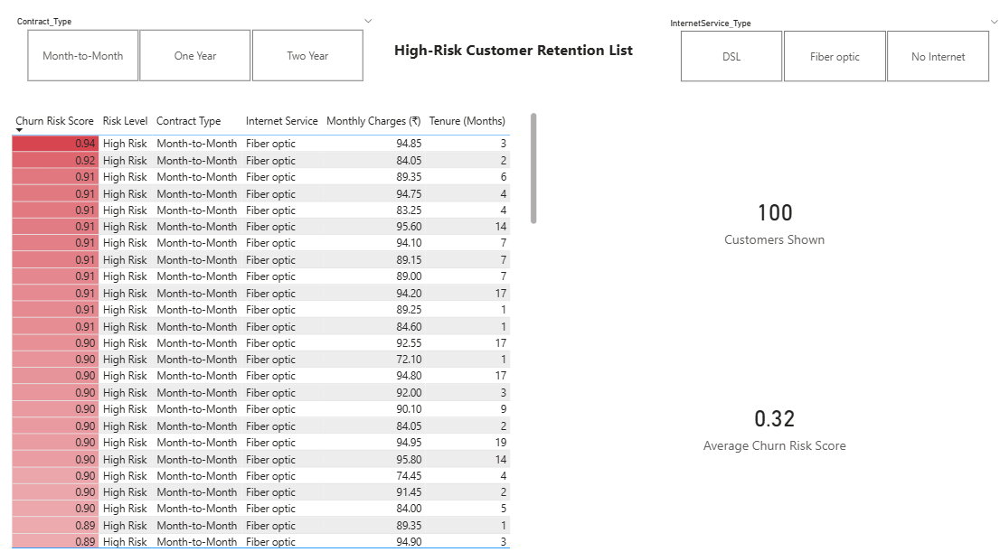

# Customer Churn Prediction & Retention Dashboard

## 📌 Project Overview
This project focuses on predicting customer churn and identifying high-risk customers to support retention strategies. 
Instead of producing only churn labels, the model generates churn probabilities and risk categories, enabling actionable business insights.

---

## 🧠 Problem Statement
Customer churn is costly for subscription-based businesses.  
The objective is to:
- Predict the probability of churn for each customer
- Identify high-risk active customers
- Provide an actionable retention list through an interactive dashboard

---

## 🔧 Tools & Technologies
- **Python** (Pandas, NumPy, Scikit-learn)
- **Machine Learning** (Logistic Regression, Random Forest, XGBoost, LightGBM, CatBoost)
- **Visualization** (Power BI)
- **EDA & Modeling** (Matplotlib, Seaborn)

---

## 📊 Methodology
1. Performed exploratory data analysis to understand churn drivers
2. Applied feature engineering and encoding techniques
3. Trained and compared multiple classification models using stratified cross-validation
4. Selected Logistic Regression based on recall and F1-score
5. Generated churn probabilities and segmented customers into risk buckets
6. Filtered predictions to active customers only
7. Built a Power BI dashboard for business users

---

## 📈 Key Insights
- Month-to-month contract customers show the highest churn risk
- Fiber optic users have higher churn probability compared to DSL users
- Churn risk decreases significantly with longer tenure

---

## 📊 Dashboard
### Executive Overview

### High-Risk Customer Action List

---

## 🎯 Business Impact
- Enables retention teams to prioritize high-risk customers
- Supports targeted retention campaigns
- Improves decision-making using probability-based risk scoring

---

## 📁 Project Structure
